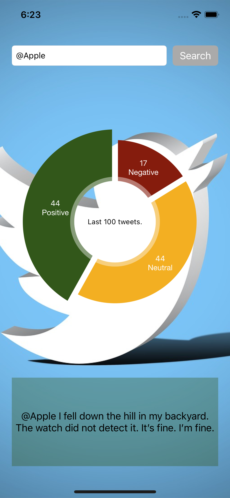

#  Twitter Sentiment iOS Project

This is a sample project, free to use (under MIT license), enhance or fix. The main purpose of this code is for educational scenarios. Please provide feedback or questions.

## About

The program runs on iOS devices, connecting to Twitter (using the Swifter API that was added via Swift Package Manager), receiving up to 100 tweets that match an entered query string. These tweets are then scored, using a NLP CoreML model (created via CreateML) to detect the sentiment (label is "-1" for negative, "0" for neutral and "1" for positive).

The result of scoring the tweets is then shown in a piechart (via the Charts package, also added to the project via SPM) together with the tweets from the selected category.

The project demonstrates a few things:
- Usage of a ML model, created with CreateML for NLP
- Usage of the Swifter API to receive Twitter messages
- Separation of functionality into MVP

## How to build and run

### Requirements
- XCode 13 or higher
- iOS 15 or higher
- Twitter Developer Account

### You'll need a Twitter API key and secret to get this code running. 
1. Go to developer.twitter.com to create a developer account (or add to existing twitter account)
2. Generate an API key and API secret. These are normally only good for the 2.0 Twitter API
3. Request an elevated API access. Swifter uses the 1.1 API that requires the elevated access, which should still be free for experimental use.

### You'll need to inject the API key and secret into the XCode project.
As you should never store, commit or upload any API keys or secret to github, you have to specifiy them separately in an xcode configuration. The main idea is to have the locally available at compile time but never to check them in to the project or github.
1. Create a new "Configuration Settings File" in xcode (parallel to the Info.plist) and name it "APISecrets". The xcoide project configurations will include that file during compile time.
2. That file should never be added or committed to github. It should actually already be "blacklisted" in the provided .gitignore file. 
3. Add two entries with the name "API_KEY" and "API_SECRET" to that new configuration file. The result should look something like this:


```
API_KEY = myAPIKeyThatIGotFromTwitter
API_SECRET = theCorrespondingAPISecret  
```

  



